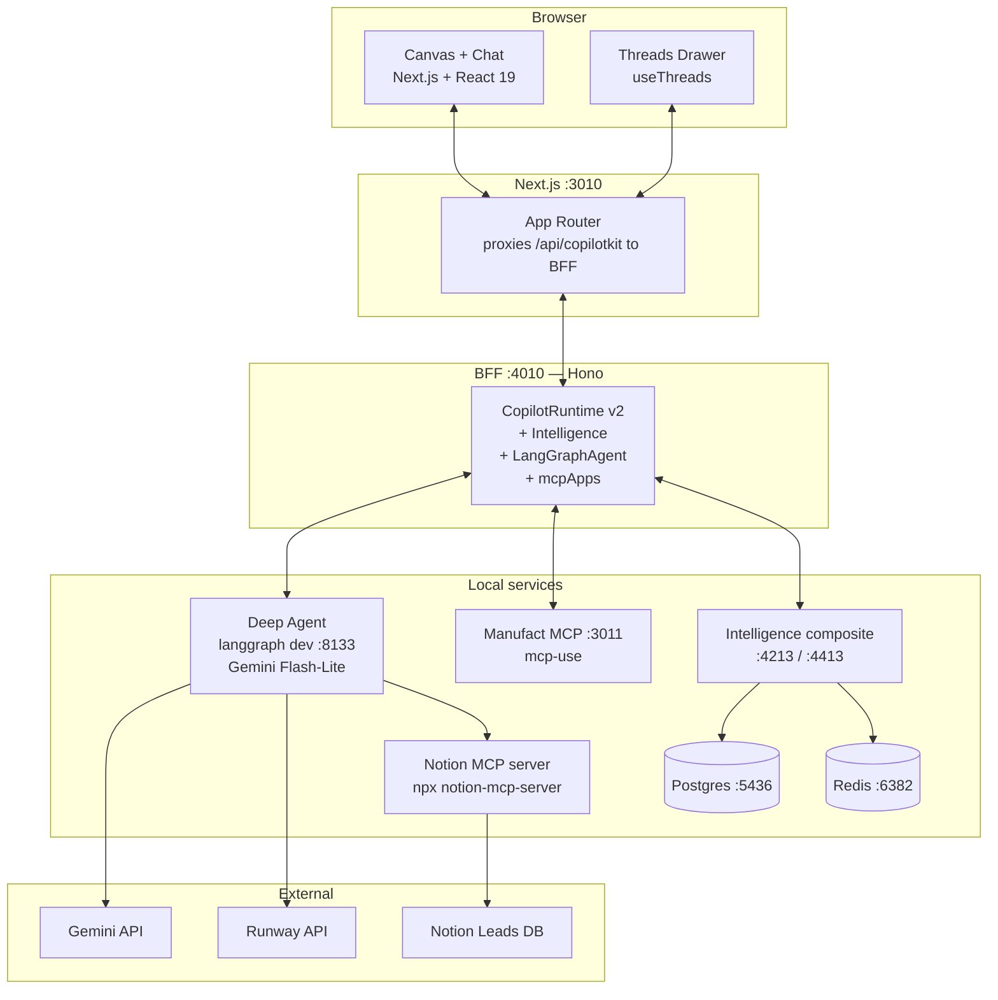
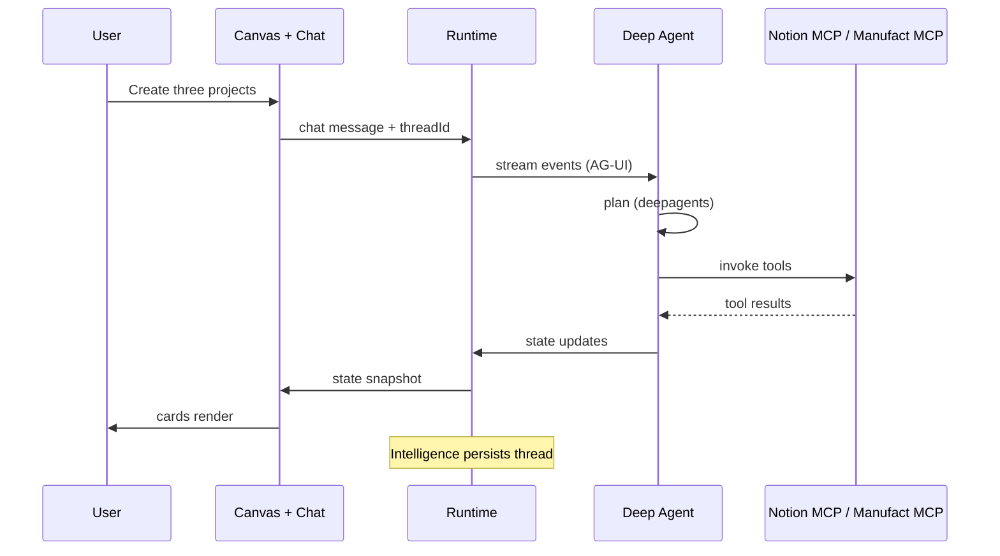

# Architecture

## System overview



> Default Intelligence/Postgres/Redis ports (`4201` / `4401` / `5432` / `6379`) are remapped to `4213` / `4413` / `5436` / `6382` via `.env` (`APP_API_HOST_PORT`, `REALTIME_GATEWAY_HOST_PORT`, `POSTGRES_HOST_PORT`, `REDIS_HOST_PORT`) so the kit boots cleanly on machines that already run another Intelligence stack. Override them in `.env` to use the originals.

## Surfaces

- **`/director`** — the storyboard canvas (Next.js, React). Type a brief → agent decomposes into shots → generates references → animates → stitches.
- **`/leads`** — the CopilotKit lead-triage demo, retained as a working second example.
- **MCP server** (`apps/mcp/`) — exposes the same capabilities to Claude / ChatGPT.

## Director pipeline

A single brief flows through five layers. Every Runway call returns a state mutation, not a chat message — that's why the canvas paints live.

```
╭───────────────╮      ╭──────────────────╮      ╭──────────────────────────╮
│  User brief   │─────▶│  Director Agent  │─────▶│  Runway API              │
│  (chat)       │      │  (LangGraph +    │      │  gen4_image (shot 0)     │
╰───────────────╯      │   Deep Agents)   │      │  gen4_image_turbo (1+)   │
                       ╰────────┬─────────╯      │  gen4.5 image→video      │
                                │                ╰──────────────┬───────────╯
                                ▼                               │
                       ╭──────────────────╮                     │
                       │ Storyboard state │◀────────────────────╯
                       │ (LangGraph TD)   │   Command(update=...)
                       ╰────────┬─────────╯
                                │ STATE_SNAPSHOT
                                ▼
                       ╭──────────────────╮
                       │  Director Canvas │
                       │  (React / AG-UI) │
                       ╰──────────────────╯
```

### Backend agent

`apps/agent/director.py` registers a `director` graph alongside the `default` (leads) graph in `langgraph.json`. Both share the same LangGraph deployment and the same Postgres-backed Intelligence threads, but each has:

- its own **system prompt** ([`storyboard_prompts.py`](../apps/agent/src/storyboard_prompts.py))
- its own **state schema** middleware ([`storyboard_state.py`](../apps/agent/src/storyboard_state.py))
- its own **tools** ([`runway_tools.py`](../apps/agent/src/runway_tools.py))

### Director tools

| Tool                        | Side effect                                                                    |
| --------------------------- | ------------------------------------------------------------------------------ |
| `generate_storyboard_plan`  | Lays out N shots as `pending` (no media yet)                                   |
| `generate_shot_reference`   | Runway text→image; sets `ref_image_url`, status → `image`                      |
| `generate_shot_video`       | Runway image→video; sets `video_url`, status → `ready`                         |
| `regenerate_shot`           | Resets one shot, optionally rewrites its prompt                                |
| `generate_all_references`   | Parallel text→image for all shots missing a ref (bounded to 4 concurrent)      |
| `generate_all_videos`       | Parallel image→video for all shots with a ref but no video                     |
| `stitch_final_cut`          | FFmpeg concat of all ready shots into one MP4; sets `final_video_url`          |

Each tool returns a `Command(update={...})`. LangGraph propagates the update; the AG-UI runtime emits `STATE_SNAPSHOT`; the React canvas re-renders. The agent never tells the UI what to draw — the UI reads the new state and draws itself.

### Runway model selection

[`runway_client.py`](../apps/agent/src/runway_client.py) is mode-switched and model-aware:

| Situation                        | Model used            | Why                                      |
| -------------------------------- | --------------------- | ---------------------------------------- |
| Shot 0 reference (no prior refs) | `gen4_image`          | `gen4_image_turbo` requires `referenceImages` |
| Shots 1+ reference               | `gen4_image_turbo`    | 2–4x cheaper, <10s, 93% quality parity  |
| All video generation             | `gen4.5`              | Better quality/control than `gen4_turbo` |
| No `RUNWAY_API_KEY`              | MOCK                  | Deterministic placeholders, no credits   |

### Cross-shot visual consistency

Shot 0's `ref_image_url` is promoted to `storyboard.style_ref_url` and used as the primary character anchor for all subsequent shots. Up to 3 prior refs are passed as `referenceImages` to `gen4_image_turbo`:

- `character1` — shot 0's ref (the primary anchor)
- `style1` — the immediately preceding shot's ref
- `style2` — the shot two positions back

The pipeline is chained, not parallel: shot 0 must complete before shots 1+ can use it as an anchor. The batch tool handles this — shot 0 runs synchronously first, then the rest run in parallel.

The agent's prompt can address the anchor explicitly: `"@character1 walks through the airlock"`.

### BYOK + budget guard

The BFF (`apps/bff/src/server.ts`) intercepts every POST to `/api/copilotkit` and injects two fields into `forwardedProps.config.configurable`:

- `runway_api_key` — the user's personal key from `X-Runway-Api-Key` header (set by the frontend from localStorage). When present, the Python agent uses it instead of the server env var, and the budget check is skipped.
- `runway_calls_remaining` / `runway_budget` — per-thread call counter (default 20 calls ≈ 10 shots). The Python agent raises `BudgetExceededError` when this hits 0.

The BFF also exposes `POST /api/runway-call-used` which the Python agent calls after each successful Runway API call to increment the counter.

### Frontend canvas

[`apps/frontend/src/app/director/page.tsx`](../apps/frontend/src/app/director/page.tsx) mounts the director agent at `agentId="director"` via `CopilotChatConfigurationProvider`. State flows in via `useAgent()`; mutations flow out via `useFrontendTool()` handlers and an `injectPrompt` round-trip for actions that need the agent.

| Component            | Role                                                                 |
| -------------------- | -------------------------------------------------------------------- |
| `BriefHeader`        | Title, logline, Runway/FFmpeg/Consistent mode pills, BYOK key button |
| `ApiKeyPanel`        | BYOK settings panel — localStorage key entry                         |
| `StoryboardTimeline` | Horizontal scroller of `ShotCard[]`                                  |
| `ShotCard`           | Per-shot media well, status pill, download + regenerate actions      |
| `ShotPreview`        | Inline mini-card the agent renders in chat                           |
| `ExportPanel`        | Stitching spinner → final video player + download button             |

### Stitched export

[`stitcher.py`](../apps/agent/src/stitcher.py) downloads each shot's `video_url`, writes an ffmpeg concat manifest, and runs:

1. Fast path: `ffmpeg -f concat -c copy` (stream copy, no re-encode)
2. Fallback: `libx264 -preset veryfast -crf 20` if codecs mismatch

Output is written to `apps/frontend/public/exports/` and served at `/exports/<slug>-<timestamp>.mp4`. Override with `EXPORT_DIR` + `EXPORT_BASE_URL` env vars for S3/R2/CDN in production.

### Why `Command(update=)` instead of frontend tools for media

Asking the model to construct a `setShots(shots=[...])` tool call with full payloads *after* generating media stalls Gemini for minutes. Routing media URLs into state via `Command(update=)` from the backend tool sidesteps that — the model only chooses **which shot**, never reconstructs the shot list.

## Leads infrastructure



## Why a separate BFF?

The CopilotKit runtime (`@copilotkit/runtime/v2`) bundles express transitively, which Next.js can't tree-shake cleanly inside an App Router API route (the dynamic `require(mod)` in express's view engine breaks turbopack bundling). The kit instead runs the runtime as a Hono BFF on port 4010, and Next.js rewrites proxy `/api/copilotkit/*` to `http://localhost:4010` (configurable via `BFF_URL` in `.env`) so frontend code stays on relative URLs and there's no CORS to manage.

## Project structure

```
apps/
├── agent/        ← Director graph (Python, LangGraph)
│   ├── director.py
│   ├── src/runway_client.py   ← model selection, BYOK, budget guard
│   ├── src/runway_tools.py    ← all 7 director tools
│   ├── src/stitcher.py        ← FFmpeg concat
│   └── src/storyboard_*.py
├── frontend/     ← /director canvas (Next.js, React)
│   └── src/app/director, components/storyboard, lib/storyboard
├── bff/          ← CopilotKit runtime + BYOK injection (Hono)
└── mcp/          ← MCP server for Claude / ChatGPT (mcp-use)
```