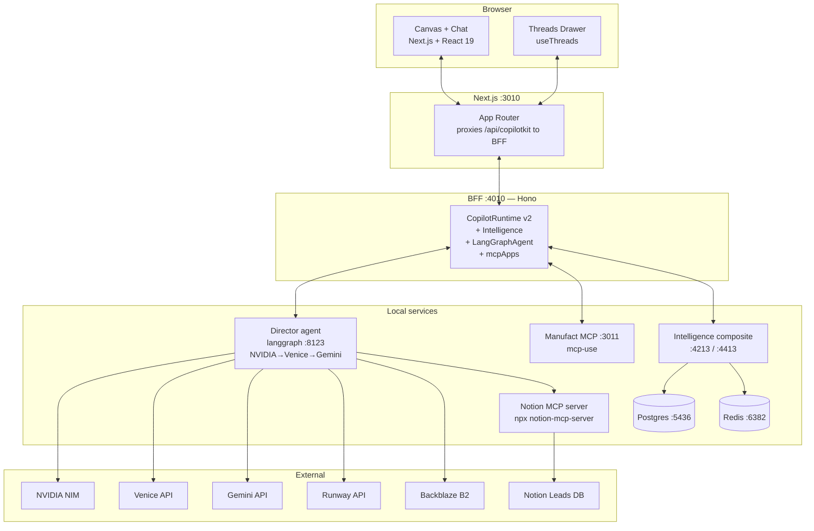
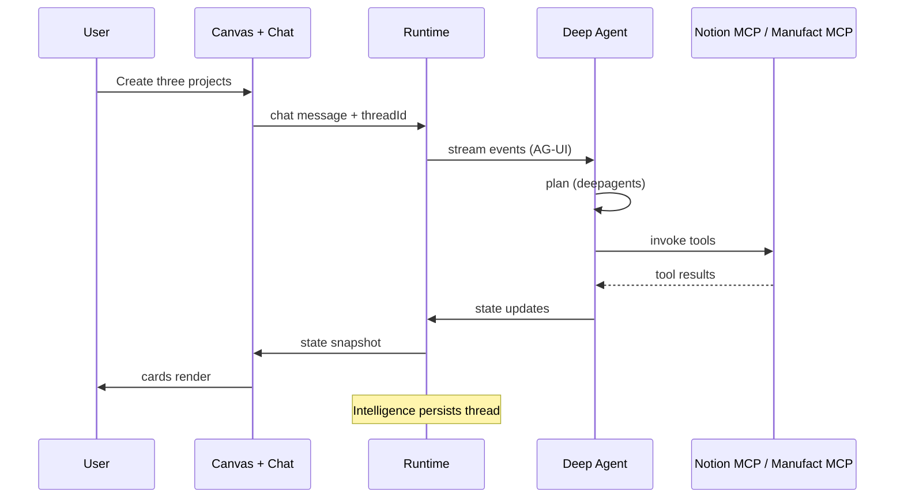

# Architecture

## System overview


```mermaid
graph TB
    subgraph Browser
        UI["Canvas + Chat<br/>Next.js + React 19"]
        Drawer["Threads Drawer<br/>useThreads"]
    end

    subgraph Frontend["Next.js :3010"]
        Next["App Router<br/>proxies /api/copilotkit to BFF"]
    end

    subgraph BFFLayer["BFF :4010 — Hono"]
        Runtime["CopilotRuntime v2<br/>+ Intelligence<br/>+ LangGraphAgent<br/>+ mcpApps"]
    end

    subgraph LocalServices["Local services"]
        Agent["Director agent<br/>langgraph :8123<br/>NVIDIA→Venice→Gemini"]
        MCP["Manufact MCP :3011<br/>mcp-use"]
        NotionMCP["Notion MCP server<br/>npx notion-mcp-server"]
        Intel["Intelligence composite<br/>:4213 / :4413"]
        DB[("Postgres :5436")]
        Cache[("Redis :6382")]
    end

    subgraph External
        Notion["Notion Leads DB"]
        NVIDIA["NVIDIA NIM"]
        Venice["Venice API"]
        Gemini["Gemini API"]
        Runway["Runway API"]
        B2["Backblaze B2"]
    end

    UI <--> Next
    Drawer <--> Next
    Next <--> Runtime
    Runtime <--> Agent
    Runtime <--> MCP
    Runtime <--> Intel
    Intel --> DB
    Intel --> Cache
    Agent --> NVIDIA
    Agent --> Venice
    Agent --> Gemini
    Agent --> Runway
    Agent --> B2
    Agent --> NotionMCP
    NotionMCP --> Notion
```

Planner inference detail: [`providers.md`](./providers.md).

> Default Intelligence/Postgres/Redis ports (`4201` / `4401` / `5432` / `6379`) are remapped to `4213` / `4413` / `5436` / `6382` via `.env` (`APP_API_HOST_PORT`, `REALTIME_GATEWAY_HOST_PORT`, `POSTGRES_HOST_PORT`, `REDIS_HOST_PORT`) so the kit boots cleanly on machines that already run another Intelligence stack. Override them in `.env` to use the originals.

## Surfaces

- **`/director`** — the storyboard canvas (Next.js, React). Type a brief → agent decomposes into shots → generates references → animates → stitches.
- **`/leads`** — the CopilotKit lead-triage demo, retained as a working second example.
- **MCP server** (`apps/mcp/`) — exposes the same capabilities to Claude / ChatGPT.

## Director pipeline

A single brief flows through five layers. Every Runway call returns a state mutation, not a chat message — that's why the canvas paints live.

```
╭───────────────╮      ╭──────────────────╮      ╭──────────────────────────╮
│  User brief   │─────▶│  Director Agent  │─────▶│  Runway API              │
│  (chat)       │      │  (LangGraph +    │      │  gen4_image (shot 0)     │
╰───────────────╯      │   Deep Agents)   │      │  gen4_image_turbo (1+)   │
                       ╰────────┬─────────╯      │  gen4.5 image→video      │
                                │                ╰──────────────┬───────────╯
                                ▼                               │
                       ╭──────────────────╮                     │
                       │ Storyboard state │◀────────────────────╯
                       │ (LangGraph TD)   │   Command(update=...)
                       ╰────────┬─────────╯
                                │ STATE_SNAPSHOT
                                ▼
                       ╭──────────────────╮
                       │  Director Canvas │
                       │  (React / AG-UI) │
                       ╰──────────────────╯
```

### Backend agent

`apps/agent/director.py` registers a `director` graph alongside the `default` (leads) graph in `langgraph.json`. Both share the same LangGraph deployment and the same Postgres-backed Intelligence threads, but each has:

- its own **system prompt** ([`storyboard_prompts.py`](../apps/agent/src/storyboard_prompts.py))
- its own **state schema** middleware ([`storyboard_state.py`](../apps/agent/src/storyboard_state.py))
- its own **tools** ([`runway_tools.py`](../apps/agent/src/runway_tools.py))

### Director tools

| Tool                        | Side effect                                                                    |
| --------------------------- | ------------------------------------------------------------------------------ |
| `generate_storyboard_plan`  | Lays out N shots as `pending` (no media yet); carries the sponsor `brand_kit`   |
| `generate_shot_reference`   | Runway text→image; sets `ref_image_url`, status → `image`                      |
| `generate_shot_video`       | Runway image→video; sets `video_url`, status → `ready`                         |
| `regenerate_shot`           | Resets one shot, optionally rewrites its prompt                                |
| `generate_all_references`   | Parallel text→image for all shots missing a ref (bounded to 4 concurrent)      |
| `generate_all_videos`       | Parallel image→video for all shots with a ref but no video                     |
| `stitch_final_cut`          | FFmpeg concat of all ready shots into one MP4; sets `final_video_url`          |
| `cut_variant_pack`          | Re-stitches the finished shots into 3 platform renditions (ADR-0005); sets `variants[]`. **Zero Runway calls** |
| `generate_recap`            | Cross-reads other threads' B2 snapshots and re-stitches a 60–90s recap. **Zero Runway calls** |
| `emit_hyperframes_kit`      | Attaches the HyperFrames handoff (`BRIEF.md` + `assets/devcut/` manifest)       |

Audio and restyle tools (`generate_shot_voiceover`, `generate_all_sfx`, `restyle_storyboard`, …) live in [`audio_tools.py`](../apps/agent/src/audio_tools.py) alongside these and follow the same `Command(update=)` contract.

Each tool returns a `Command(update={...})`. LangGraph propagates the update; the AG-UI runtime emits `STATE_SNAPSHOT`; the React canvas re-renders. The agent never tells the UI what to draw — the UI reads the new state and draws itself.

Two of those tools survive a wiped LangGraph checkpoint: `stitch_final_cut` and `cut_variant_pack` call `_state_or_snapshot()`, which tops the injected state up from the thread's own B2 snapshot, and flag the resulting publish `partial` so the writer inherits keys the run never saw (`final_video_url`, `export_status`, `builder_kit`). See `_finalize()` in [`runway_tools.py`](../apps/agent/src/runway_tools.py).

### Runway model selection

[`runway_client.py`](../apps/agent/src/runway_client.py) is mode-switched and model-aware:

| Situation                        | Model used            | Why                                      |
| -------------------------------- | --------------------- | ---------------------------------------- |
| Shot 0 reference (no prior refs) | `gen4_image`          | `gen4_image_turbo` requires `referenceImages` |
| Shots 1+ reference               | `gen4_image_turbo`    | 2–4x cheaper, <10s, 93% quality parity  |
| All video generation             | `gen4.5`              | Better quality/control than `gen4_turbo` |
| No `RUNWAY_API_KEY`              | MOCK                  | Deterministic placeholders, no credits   |

### Cross-shot visual consistency

Shot 0's `ref_image_url` is promoted to `storyboard.style_ref_url` and used as the primary character anchor for all subsequent shots. Up to 3 prior refs are passed as `referenceImages` to `gen4_image_turbo`:

- `character1` — shot 0's ref (the primary anchor)
- `style1` — the immediately preceding shot's ref
- `style2` — the shot two positions back

The pipeline is chained, not parallel: shot 0 must complete before shots 1+ can use it as an anchor. The batch tool handles this — shot 0 runs synchronously first, then the rest run in parallel.

The agent's prompt can address the anchor explicitly: `"@character1 walks through the airlock"`.

### BYOK + budget guard

The BFF (`apps/bff/src/server.ts`) intercepts every POST to `/api/copilotkit` and injects two fields into `forwardedProps.config.configurable`:

- `runway_api_key` — the user's personal key from `X-Runway-Api-Key` header (set by the frontend from localStorage). When present, the Python agent uses it instead of the server env var, and the budget check is skipped.
- `runway_calls_remaining` / `runway_budget` — per-thread call counter (default 20 calls ≈ 10 shots). The Python agent raises `BudgetExceededError` when this hits 0.

The BFF also exposes `POST /api/runway-call-used` which the Python agent calls after each successful Runway API call to increment the counter.

### Frontend canvas

[`apps/frontend/src/app/director/page.tsx`](../apps/frontend/src/app/director/page.tsx) mounts the director agent at `agentId="director"` via `CopilotChatConfigurationProvider`. State flows in via `useAgent()`; mutations flow out via `useFrontendTool()` handlers and an `injectPrompt` round-trip for actions that need the agent.

| Component            | Role                                                                 |
| -------------------- | -------------------------------------------------------------------- |
| `BriefHeader`        | Title, logline, Challenge/Submit mode badge, LIVE/MOCK, x402 pill    |
| `ApiKeyPanel`        | BYOK settings panel — localStorage key entry                         |
| `StoryboardTimeline` | Horizontal scroller of `ShotCard[]`                                  |
| `ShotCard`           | Per-shot media well, status pill, download + regenerate actions      |
| `ShotPreview`        | Inline mini-card the agent renders in chat                           |
| `JobOutcomePanel`    | After stitch: **Watch cut · Vault · Variants · HyperFrames · Share** (+ kit.zip + B2 verify) |
| Chat run ledger      | DevCut-shaped stages + human tool cards (`devcut-ledger.ts`)         |

Landing (`/`) is three human doors — challenge / submit / product — plus the **Run HyperFrames demo** CTA; the fourth door, **agent**, lives on `/director` as the x402 panel rather than a landing tab. See [`hyperframes.md`](./hyperframes.md) and [`x402.md`](./x402.md).

The canvas restores a finished thread from the URL: `/director?thread=<id>` reads `/api/thread-state` (LangGraph state first, B2 snapshot when the checkpoint is gone). `&hackathon=<challenge_thread_id>` additionally makes the client POST the graph edge once the run settles.

**WebMCP (ADR-0004):** `DirectorCanvas` publishes handlers + live `StoryboardState` to the `directorController` singleton and registers 5 tools on `document.modelContext` (`get_storyboard_state`/`get_export` read-only; `start_cutdown`/`regenerate_shot`/`cancel_run` auth-gated). Mutating tools start runs and return immediately — agents poll state. Same session ⇒ same BYOK vault, budget, and `ui_thread_id` billing. `get_export` summarizes `variants[]` too, so an external agent can see the platform renditions. Runtime surface confirmed against Chrome 154 behind the WebMCP flag (2026-10-03, local dev build; prod is proven only to *serve* the registrations). — including that `executeTool` takes the registered descriptor plus a JSON string.

### Stitched export

[`stitcher.py`](../apps/agent/src/stitcher.py) downloads each shot's `video_url`, writes an ffmpeg concat manifest, and runs:

1. Fast path: `ffmpeg -f concat -c copy` (stream copy, no re-encode)
2. Fallback: `libx264 -preset veryfast -crf 20` if codecs mismatch

Output is written to `apps/frontend/public/exports/` and served at `/exports/<slug>-<timestamp>.mp4`. Override with `EXPORT_DIR` + `EXPORT_BASE_URL` env vars for S3/R2/CDN in production.

### Plan-driven re-stitch (variants + recap)

The master cut above is concat-only. `variant_pack` / `recap_reel` go through `stitch_plan()` in the same [`stitcher.py`](../apps/agent/src/stitcher.py), driven by a data plan built in [`variant_plan.py`](../apps/agent/src/variant_plan.py) — no ffmpeg knowledge in the plan layer, so the plans are unit-testable on their own:

1. **Per-clip normalize** — scale + center-crop (or pad) to the target aspect and re-encode `libx264 -preset veryfast -crf 20` / `aac 192k`, laying an `anullsrc` bed under any clip that has no audio track, so every segment shares the parameters concat needs.
2. **Captions, with a degrade chain** — `libass subtitles=` → `drawtext` → SRT sidecar, picked by a cached `ffmpeg -filters` probe. **A missing filter never fails a paid job**; the rendition just ships with a sidecar. Burned-in line times are per-clip (subtract `clip.in`); sidecar times live on the concatenated timeline.
3. **Concat** via the existing stream-copy path, then persist through media storage.

The ASS event writer and its `Format:` declaration are one shared constant (`ASS_EVENT_FORMAT` + `ass_event()`) on purpose: libass puts everything after the last declared field into the rendered text, and a 5-field format against 10-field events once printed ",0,0,0,,Problem" on screen in a shipped rendition.

Recap plans impose a 60–90s budget (≤2 clips per winner thread, ≤8s each), sponsor lockup first and last, CTA on the final clip, and default to `reuse_master`/`silent` audio — regenerating VO across 6+ threads would blow the 20-call Runway budget the SKU price assumes.

### Why `Command(update=)` instead of frontend tools for media

Asking the model to construct a `setShots(shots=[...])` tool call with full payloads *after* generating media stalls Gemini for minutes. Routing media URLs into state via `Command(update=)` from the backend tool sidesteps that — the model only chooses **which shot**, never reconstructs the shot list.

## Leads infrastructure


```mermaid
sequenceDiagram
    participant User
    participant UI as Canvas + Chat
    participant Runtime
    participant Agent as Deep Agent
    participant Tools as Notion MCP / Manufact MCP

    User->>UI: Create three projects
    UI->>Runtime: chat message + threadId
    Runtime->>Agent: stream events (AG-UI)
    Agent->>Agent: plan (deepagents)
    Agent->>Tools: invoke tools
    Tools-->>Agent: tool results
    Agent->>Runtime: state updates
    Runtime->>UI: state snapshot
    UI->>User: cards render
    Note over Runtime: Intelligence persists thread
```

## Why a separate BFF?

The CopilotKit runtime (`@copilotkit/runtime/v2`) bundles express transitively, which Next.js can't tree-shake cleanly inside an App Router API route (the dynamic `require(mod)` in express's view engine breaks turbopack bundling). The kit instead runs the runtime as a Hono BFF on port 4010, and Next.js rewrites proxy `/api/copilotkit/*` to `http://localhost:4010` (configurable via `BFF_URL` in `.env`) so frontend code stays on relative URLs and there's no CORS to manage.

## Project structure

```
apps/
├── agent/        ← Director graph (Python, LangGraph)
│   ├── director.py
│   ├── src/runway_client.py   ← model selection, BYOK, budget guard
│   ├── src/runway_tools.py    ← the 10 director tools (+ audio_tools.py)
│   ├── src/stitcher.py        ← FFmpeg concat + plan-driven stitch_plan()
│   ├── src/variant_plan.py    ← pure data: variant/recap plans, ASS + SRT writers
│   ├── src/recap_sources.py   ← cross-thread B2 snapshot reads
│   ├── src/state_snapshots.py ← post-tool B2 snapshots (cross-restart restore)
│   └── src/storyboard_*.py
├── frontend/     ← /director canvas (Next.js, React)
│   └── src/app/director, app/organizer, components/storyboard,
│       lib/storyboard, lib/webmcp
├── bff/          ← CopilotKit runtime + BYOK injection (Hono)
│   └── src/x402/, organizer.ts, thread-links.ts, vault.ts, health.ts
└── mcp/          ← MCP server for Claude / ChatGPT (mcp-use)
```

## Organizer surface

`/organizer` lists an org's threads (`apps/bff/src/organizer.ts`), each enriched from its B2 snapshot so the dashboard still shows finished cuts when the LangGraph checkpoint is gone, and multi-selects ready ones into a `$4` recap commission.

- `POST /api/organizer/recap` — **auth-gated**, unlike the open x402 demo endpoints. Refuses: no session (401), fewer than 2 selected threads (400), threads outside the caller's org (403), threads with no finished cut (400). Then pulls the challenge thread's brand-kit logo from its snapshot and fulfills the paid `recap_reel` job with a brief that instructs the agent to call `generate_recap` once, re-stitch only.
- `devcut_thread_links` (Postgres, `apps/bff/src/thread-links.ts`) — the hackathon graph: submission thread → `hackathon_thread_id`. Written by `POST /api/thread-links` when a `&hackathon=` run settles on the canvas; `GET /api/organizer/thread-links?hackathon=` lists an event's entries. The table self-creates on first write, so it does not exist on a fresh database until something posts to it.

Event-wide tenancy (who may see an event's threads at all) is deliberately *not* here yet — that's [ADR-0006](./adr/0006-event-tenancy.md), proposed.